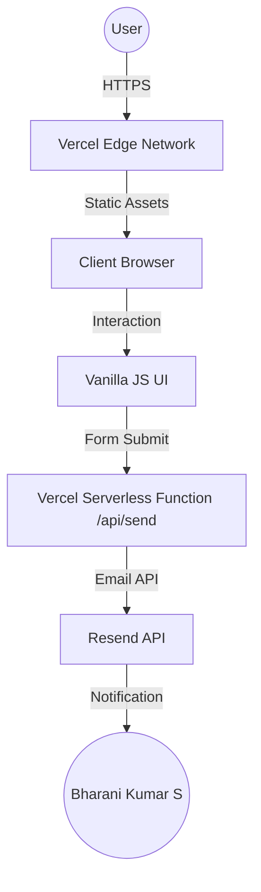

# <a name="header"></a>PORTFOLIO
> Dark, lime-accented one-page portfolio of Bharani Kumar S — an AI full-stack developer.

[](https://vincenzo-afk.vercel.app/)
[](LICENSE)
[](https://vincenzo-afk.github.io/PORTFOLIO/)
[](https://github.com/vincenzo-afk?tab=repositories)

[**Live Demo**](https://vincenzo-afk.vercel.app/) • [**Source Code**](https://github.com/vincenzo-afk/PORTFOLIO) • [**Report Bug**](https://github.com/vincenzo-afk/PORTFOLIO/issues) • [**Request Feature**](https://github.com/vincenzo-afk/PORTFOLIO/issues)

---

## <a name="toc"></a>Table of Contents
- [About the Project](#about)
- [Tech Stack](#tech-stack)
- [Getting Started](#getting-started)
- [Usage](#usage)
- [API Reference](#api-reference)
- [Project Structure](#project-structure)
- [Features & Roadmap](#features-roadmap)
- [Testing](#testing)
- [Deployment](#deployment)
- [Contributing](#contributing)
- [Security](#security)
- [License](#license)
- [Acknowledgments](#acknowledgments)
- [Footer](#footer)

---

## <a name="about"></a>About the Project
This project is a high-performance, single-page portfolio designed to showcase the work and skills of **Bharani Kumar S**. It features a modern "Neobrutalist" dark theme with lime accents, smooth animations, and a focus on SEO and user experience.

### Key Features
- 🚀 **High Performance:** Single-page architecture with optimized assets and zero build step.
- 🎨 **Modern Design:** Dark theme with lime accents, spotlight cursor effects, and smooth scroll animations.
- 📱 **Fully Responsive:** Optimized for all devices, from mobile to ultra-wide monitors.
- 🔍 **SEO Optimized:** Comprehensive meta tags, Open Graph data, and structured JSON-LD for search engine visibility.
- 📧 **Contact Form:** Integrated with Resend API via Vercel serverless functions for reliable message delivery.
- 🛠️ **Project Showcase:** Dynamic grid featuring 46+ selected AI and full-stack projects.

### Architecture Overview


---

## <a name="tech-stack"></a>Tech Stack

| Category | Technology |
| :--- | :--- |
| **Frontend** | Vanilla HTML5, CSS3, JavaScript (ES6+) |
| **Animations** | CSS Keyframes, requestAnimationFrame, IntersectionObserver |
| **Typography** | Inter, Space Grotesk (Google Fonts) |
| **Backend** | Node.js (Vercel Serverless Functions) |
| **Third-party** | Resend API (Email), GitHub (Assets/Hosting) |
| **Infrastructure** | Vercel, GitHub Pages |
| **SEO** | Schema.org JSON-LD, Sitemap.xml, Open Graph |

---

## <a name="getting-started"></a>Getting Started

### Prerequisites
- A modern web browser.
- (Optional) [Vercel CLI](https://vercel.com/docs/cli) for local API testing.
- [Resend API Key](https://resend.com/) for the contact form.

### Installation
1. Clone the repository:
   ```bash
   git clone https://github.com/vincenzo-afk/PORTFOLIO.git
   cd PORTFOLIO
   ```
2. Open `index.html` directly in your browser for the static site.
3. For local API testing:
   ```bash
   vercel dev
   ```

### Configuration
Create a `.env` file (or set in Vercel dashboard):
```env
# Required — without it the contact form politely refuses to send.
RESEND_API_KEY=re_xxxxxxxxxxxxxxxxxxxxxxxxxxxxx

# Optional — who the email appears to come from.
# Resend's onboarding sender is used if unset.
RESEND_FROM=Portfolio Contact <contact@yourdomain.com>

# Optional — where contact messages are delivered (defaults to the owner's email).
RESEND_TO=itsmebk2007@gmail.com
```

---

## <a name="usage"></a>Usage
The portfolio is a static site. Most interactions are automatic (scroll animations, cursor spotlight).

### Customizing Projects
To update the projects list, edit the `index.html` file within the `<section class="work">` block. Each project is represented by a `.work-card` div.

---

## <a name="api-reference"></a>API Reference

### Contact Form Endpoint
`POST /api/send`

**Request Body:**
```json
{
  "name": "John Doe",
  "email": "john@example.com",
  "message": "Hello, I would like to collaborate!"
}
```

**Response (200 OK):**
```json
{
  "success": true,
  "id": "email_id_from_resend"
}
```

---

## <a name="project-structure"></a>Project Structure
```text
.
├── api/
│   └── send.js          # Vercel serverless function for emails
├── assets/
│   ├── bk-avatar.png    # Main profile image
│   ├── github-mark.svg  # Official GitHub logo
│   └── og-portfolio.png # Social sharing card
├── scripts/
│   └── prepare_logo.py  # Asset generation script
├── index.html           # Main entry point (HTML/CSS/JS)
├── vercel.json          # Vercel routing & headers config
├── sitemap.xml          # SEO Sitemap
├── CONTRIBUTING.md      # Contribution guidelines
├── SECURITY.md          # Security policy
└── LICENSE              # MIT License
```

---

## <a name="features-roadmap"></a>Features & Roadmap
- [x] Responsive dark theme with lime accents
- [x] Smooth scroll and spotlight cursor effects
- [x] Resend API integration for contact form
- [x] SEO optimization and Social Graph cards
- [x] GitHub Actions for Pages deployment
- [ ] Add dark/light mode toggle
- [ ] Implement a dynamic project filter system
- [ ] Add a blog section for AI research notes

---

## <a name="testing"></a>Testing
This project uses manual visual regression testing across different viewports.
To verify the API endpoint locally:
```bash
curl -X POST http://localhost:3000/api/send \
  -H "Content-Type: application/json" \
  -d '{"name":"Test","email":"test@example.com","message":"Hello"}'
```

---

## <a name="deployment"></a>Deployment

### Vercel (Recommended)
The project is optimized for Vercel. Simply connect your GitHub repository to Vercel, and it will auto-deploy.

### GitHub Pages
A workflow is included in `.github/workflows/deploy.yml` to deploy the static portion of the site to GitHub Pages. Note: The contact form requires a backend (Vercel) to function.

---

## <a name="contributing"></a>Contributing
Please see [CONTRIBUTING.md](CONTRIBUTING.md) for details on how to get involved.

---

## <a name="security"></a>Security
Please see [SECURITY.md](SECURITY.md) for our security policy and vulnerability reporting process.

---

## <a name="license"></a>License
This project is licensed under the MIT License - see the [LICENSE](LICENSE) file for details.

---

## <a name="acknowledgments"></a>Acknowledgments
- **Design Inspiration:** Modern Neobrutalist web design trends.
- **Icons:** Official GitHub and Social brand marks.
- **Special Thanks:** The AI community for the inspiration behind the 70+ projects showcased here.

---

## <a name="footer"></a>Footer
[Back to Top](#header)

**Connect with me:**
[GitHub](https://github.com/vincenzo-afk) • [LinkedIn](https://www.linkedin.com/in/bharani-kumar-a13673327) • [X/Twitter](https://x.com/abnormal84662) • [Instagram](https://www.instagram.com/vinzo.verse)

Built with ❤️ by **Bharani Kumar S**
